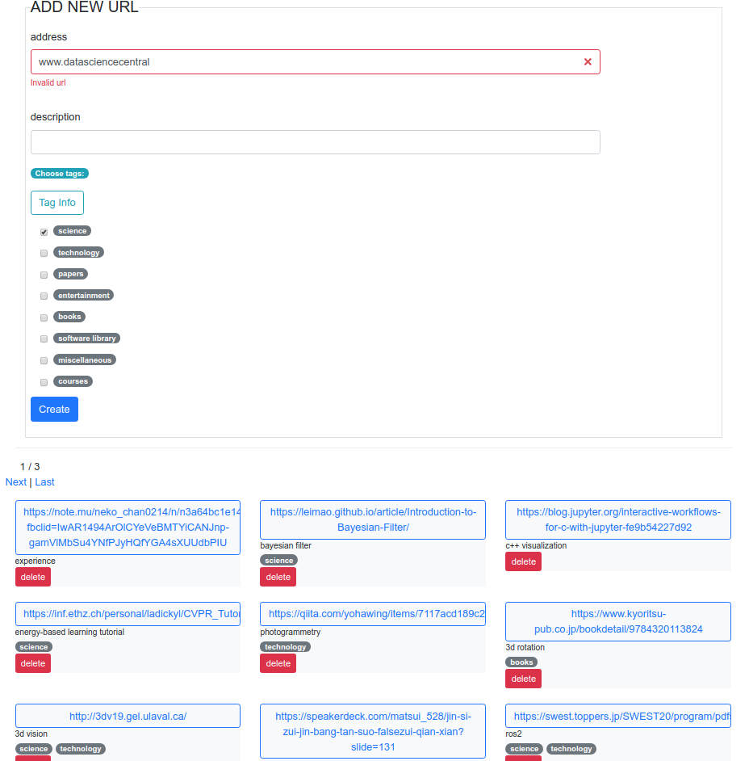

[](https://travis-ci.org/xmba15/bookmark_url/builds)
# Spring-Boot Based Web Application to Store Web URL for Browsing Later #

<p align="center">
    
</p>

## Dependencies ##
- Java: 8
- SpringBoot: tested with 2.1.6.RELEASE (possibly able to used with other versions)
- Database: Mysql version >= 5.7
- Java build automation tool: Maven

**Note: check pom.xml for more details about necessary dependencies**

## Preparation of MySQL Database ##
- Access DB
```bash
sudo mysql --password
```
- Create url_bookmarks database with the following commands:

```
mysql> create database url_bookmarks;
mysql> create user 'meuser'@'%' identified by 'SqlPassword1232:';
mysql> grant all on url_bookmarks.* to 'meuser'@'%';
```

## Build with Maven ##
- Update dependencies
```bash
./mvnw dependency:tree
```

- Run application
```bash
./mvnw spring-boot:run
```

- Packaging
```bash
# clean package
./mvnw clean package

# create package
./mvnw package

# run package
java -jar ./target/*.jar
```
